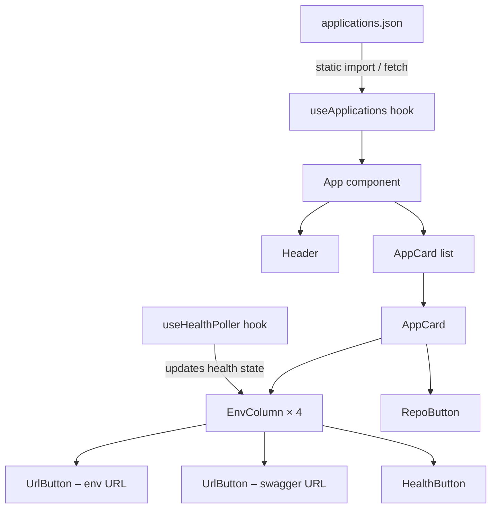

# Design Document

## Bolttech Poland Applications Dashboard

---

## Overview

The Bolttech Poland Applications Dashboard is a client-side single-page application (SPA) built with React 18, Vite, and Tailwind CSS. It reads a static `applications.json` file and renders a card-based UI showing every internal application's environment URLs, Swagger links, repository link, and live health-check status. There is no backend, no routing, and no authentication — access is controlled at the network level via VPN.

The primary design goals are:

- Zero-dependency data layer: `applications.json` is the single source of truth.
- Live health visibility: a background poller fires every 5 minutes; users can also trigger an immediate re-check by clicking a health button.
- Responsive layout: usable from 375 px (mobile) to 1440 px (wide desktop).
- Bolttech brand identity: dark theme, `#00bcc5` / `#150e4f` palette, company logo in the header.

---

## Architecture

The application is a pure client-side React SPA with no server component.



**Data flow:**

1. On mount, `useApplications` imports `applications.json` (static Vite import) and exposes the parsed array.
2. `useHealthPoller` receives the full application list, maintains a `Map<string, HealthStatus>` keyed by `healthCheckUrl`, fires an initial poll immediately, then repeats every 5 minutes via `setInterval`.
3. Each `HealthButton` reads its status from the shared health state map and can trigger an on-demand re-check.
4. All Tailwind class composition goes through `tailwind-merge` (`twMerge`) to avoid class conflicts.

---

## Components and Interfaces

### Component Tree

```
App
├── Header
└── main
    └── AppCard[]
        ├── CardHeader (app name + RepoButton)
        └── EnvGrid
            └── EnvColumn[] (tst | uat | pre | prd)
                ├── EnvColumnHeader (label)
                ├── UrlButton  (environment URL – copy to clipboard)
                ├── UrlButton  (swagger URL – open new tab)
                └── HealthButton
```

### Component Interfaces

#### `Header`
```tsx
// No props — renders logo and dashboard title
```

#### `AppCard`
```tsx
interface AppCardProps {
  app: Application;
  healthMap: HealthMap;
  onHealthCheck: (url: string) => void;
}
```

#### `EnvColumn`
```tsx
interface EnvColumnProps {
  label: string;                  // "tst" | "uat" | "pre" | "prd"
  env: Environment | undefined;   // undefined → all buttons disabled
  healthMap: HealthMap;
  onHealthCheck: (url: string) => void;
}
```

#### `UrlButton`
```tsx
type UrlButtonVariant = "env" | "swagger";

interface UrlButtonProps {
  variant: UrlButtonVariant;
  url: string | null | undefined;
  label: string;
}
```

- `variant = "env"` → copies URL to clipboard on click.
- `variant = "swagger"` → opens URL in new tab on click.
- Empty/null URL → disabled gray state, no action on click.

#### `HealthButton`
```tsx
interface HealthButtonProps {
  url: string | null | undefined;
  status: HealthStatus;           // "unknown" | "healthy" | "unhealthy" | "loading"
  onCheck: () => void;
}
```

#### `RepoButton`
```tsx
interface RepoButtonProps {
  url: string | null | undefined;
}
```

### Custom Hooks

#### `useApplications`
```ts
function useApplications(): {
  applications: Application[];
  error: string | null;
}
```
Loads `applications.json` via static Vite import. Returns the parsed array or an error string.

#### `useHealthPoller`
```ts
function useHealthPoller(applications: Application[]): {
  healthMap: HealthMap;
  checkNow: (url: string) => void;
}
```
- Initialises all known `healthCheckUrl` entries to `"unknown"`.
- Fires an immediate full poll on mount.
- Schedules `setInterval` for 5-minute repeating polls.
- `checkNow(url)` sets that entry to `"loading"` then fires a single fetch.
- Cleans up the interval on unmount.

---

## Data Models

### `applications.json` Schema

```ts
interface ApplicationsFile {
  Applications: Application[];
}

interface Application {
  Name: string;
  repositoryUrl: string | null;
  Environments: Environment[];
}

interface Environment {
  name: "tst" | "uat" | "pre" | "prd";
  url: string | null;
  swaggerUrl: string | null;
  healthCheckUrl: string | null;
}
```

### Runtime State

```ts
type HealthStatus = "unknown" | "healthy" | "unhealthy" | "loading";

// Key: healthCheckUrl string
type HealthMap = Map<string, HealthStatus>;
```

### Button Visual State Mapping

| Condition | Color |
|---|---|
| URL is empty / null | Gray (disabled) |
| `HealthStatus = "unknown"` | Gray |
| `HealthStatus = "loading"` | Gray + spinner |
| `HealthStatus = "healthy"` | Green |
| `HealthStatus = "unhealthy"` | Red |
| Copy success feedback | Brief teal flash |

### Layout Constants

| Breakpoint | Columns per card |
|---|---|
| `< 640px` (sm) | 1 (stacked) |
| `640px – 1023px` (sm–md) | 2 |
| `≥ 1024px` (lg+) | 4 |

Tailwind grid: `grid grid-cols-1 sm:grid-cols-2 lg:grid-cols-4`

---

## Correctness Properties

*A property is a characteristic or behavior that should hold true across all valid executions of a system — essentially, a formal statement about what the system should do. Properties serve as the bridge between human-readable specifications and machine-verifiable correctness guarantees.*

### Property 1: Data drives card count

*For any* `applications.json` containing N entries in the `Applications` array, the rendered dashboard SHALL contain exactly N Application_Cards.

**Validates: Requirements 1.1, 1.2**

---

### Property 2: Application name appears in its card

*For any* application in `applications.json`, the rendered Application_Card for that application SHALL contain the application's `Name` string.

**Validates: Requirements 2.2**

---

### Property 3: Card structure invariant

*For any* Application_Card, it SHALL contain exactly 4 Environment_Columns with labels `["tst", "uat", "pre", "prd"]` in that order, and each Environment_Column SHALL contain exactly 3 URL_Buttons in the order: environment URL, swagger URL, health check.

**Validates: Requirements 2.3, 2.4**

---

### Property 4: Null URL disables button and suppresses action

*For any* URL_Button (environment, swagger, health, or repository) whose source URL is empty or null, the button SHALL be rendered in a disabled/gray state and SHALL NOT trigger any action (clipboard write, navigation, or fetch) when clicked.

**Validates: Requirements 3.3, 4.2, 5.6, 6.2**

---

### Property 5: Non-null URL opens in new tab

*For any* Swagger_URL button or Repository button with a non-null URL, clicking the button SHALL open that URL in a new browser tab.

**Validates: Requirements 4.1, 6.1**

---

### Property 6: Environment URL copy to clipboard

*For any* Environment_URL button with a non-null URL, clicking the button SHALL invoke the clipboard API with the exact URL string as its argument.

**Validates: Requirements 3.1**

---

### Property 7: Health poller covers all non-null URLs

*For any* set of applications loaded from `applications.json`, the Poller SHALL call `fetch` for every non-null `healthCheckUrl` on initial mount and again after each 5-minute interval.

**Validates: Requirements 5.1**

---

### Property 8: Health status reflects HTTP response code

*For any* `healthCheckUrl` that receives a response, the displayed `HealthStatus` SHALL be `"healthy"` if the HTTP status code is in the range 200–299, and `"unhealthy"` otherwise.

**Validates: Requirements 5.2, 5.3**

---

### Property 9: Network or CORS failure yields unknown status

*For any* `healthCheckUrl` whose `fetch` call rejects (network error, CORS block, or any thrown exception), the displayed `HealthStatus` SHALL be `"unknown"`.

**Validates: Requirements 5.7**

---

### Property 10: On-demand health check triggers immediate fetch

*For any* HealthCheck button with a non-null URL, clicking the button SHALL immediately dispatch a `fetch` call to that URL and update the displayed `HealthStatus` upon resolution.

**Validates: Requirements 5.5**

---

### Property 11: No horizontal overflow at any supported viewport width

*For any* viewport width in the range 375 px – 1440 px, the rendered dashboard SHALL NOT produce horizontal scrollbar or overflow on the document body.

**Validates: Requirements 8.1**

---

## Error Handling

| Scenario | Behaviour |
|---|---|
| `applications.json` fails to load (network, parse error) | `useApplications` sets `error` string; `App` renders a full-page error banner with the message. No cards are rendered. |
| `healthCheckUrl` fetch rejects (CORS, network timeout) | `useHealthPoller` catches the rejection and sets that URL's status to `"unknown"`. No error is surfaced to the user beyond the gray button. |
| `healthCheckUrl` returns non-2xx | Status set to `"unhealthy"` (red). Not treated as an exception. |
| Clipboard API unavailable | `UrlButton` catches the rejection from `navigator.clipboard.writeText` and silently no-ops (no visual feedback shown). |
| Missing environment in `applications.json` | `EnvColumn` receives `undefined` for that environment; all three buttons render in disabled gray state. |
| `repositoryUrl` / any URL is `null` or `""` | Button renders disabled; click handler is a no-op. |

---

## Testing Strategy

### Dual Testing Approach

Both unit tests and property-based tests are required. They are complementary:

- **Unit tests** cover specific examples, integration points, and error conditions.
- **Property-based tests** verify universal invariants across randomly generated inputs.

### Unit Tests (Vitest + React Testing Library)

Specific examples and edge cases to cover:

- `useApplications` returns error string when fetch/import throws.
- `HealthButton` shows loading spinner while fetch is in-flight (mock fetch that never resolves).
- `HealthButton` shows gray `unknown` on initial render before first poll.
- `Header` renders an `` with `src` containing `bolttech-thumbnailtwitter.avif`.
- `AppCard` renders all 4 column headers in correct order.
- `EnvColumn` with `undefined` env renders all 3 buttons disabled.
- Copy success feedback: after clicking an env URL button, a "copied" indicator appears.
- Responsive reflow: at 375 px viewport the grid switches to single-column layout.

### Property-Based Tests (fast-check + Vitest)

Each property test runs a minimum of **100 iterations**. Each test is tagged with a comment in the format:

`// Feature: bolttech-apps-dashboard, Property N: <property_text>`

| Property | Test description |
|---|---|
| Property 1 | Generate random arrays of N applications; assert rendered card count equals N |
| Property 2 | Generate random application names; assert each name appears in its card |
| Property 3 | Generate random application lists; assert every card has 4 columns with correct labels and 3 buttons each |
| Property 4 | Generate null/empty URL values for each button type; assert button is disabled and no side-effect fires on click |
| Property 5 | Generate random valid URLs for swagger/repo buttons; assert `window.open` called with correct URL and `_blank` target |
| Property 6 | Generate random valid URLs for env buttons; assert `navigator.clipboard.writeText` called with exact URL |
| Property 7 | Generate random application lists with mixed null/non-null health URLs; assert fetch called exactly once per non-null URL on mount |
| Property 8 | Generate random HTTP status codes; assert health status is `"healthy"` iff code is 200–299 |
| Property 9 | Simulate fetch rejection for random URLs; assert status becomes `"unknown"` |
| Property 10 | Generate random health URLs; simulate button click; assert fetch dispatched immediately |
| Property 11 | Generate random viewport widths in [375, 1440]; assert `document.body.scrollWidth <= window.innerWidth` |

### Property-Based Testing Library

**fast-check** (`npm install --save-dev fast-check`) is the chosen PBT library. It integrates natively with Vitest and provides rich arbitrary generators for strings, numbers, arrays, and records.

```ts
// Example skeleton
import fc from "fast-check";
import { describe, it, expect } from "vitest";

describe("Property 1: Data drives card count", () => {
  // Feature: bolttech-apps-dashboard, Property 1: data drives card count
  it("renders exactly N cards for N applications", () => {
    fc.assert(
      fc.property(fc.array(arbApplication(), { minLength: 0, maxLength: 20 }), (apps) => {
        const { getAllByRole } = render(<App applications={apps} />);
        expect(getAllByRole("region")).toHaveLength(apps.length);
      }),
      { numRuns: 100 }
    );
  });
});
```
